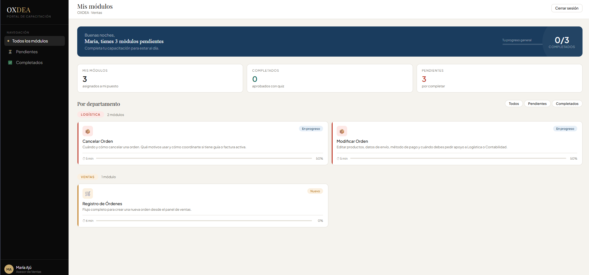
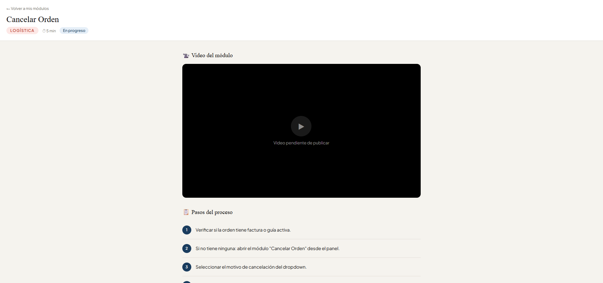
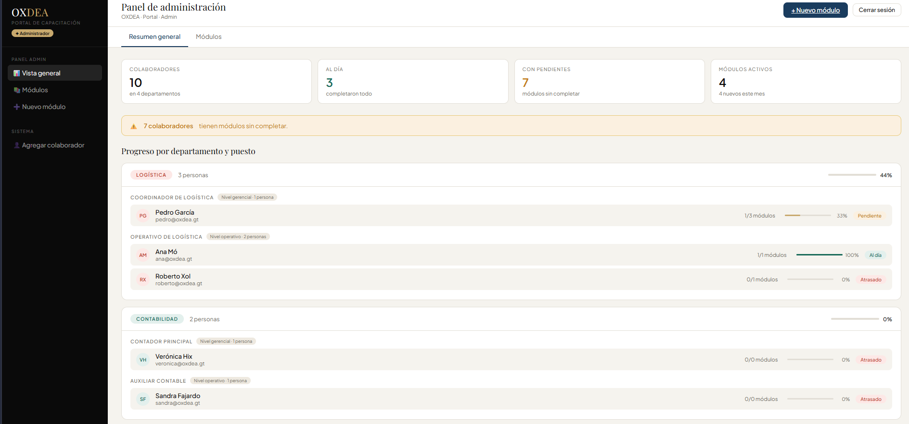

# Training Portal

A lightweight self-hosted internal training platform built with Node.js, Express, and SQLite.

Employees log in with their company email, complete assigned training modules (video + step-by-step guide + quiz), and track their own progress. Administrators can manage modules, assign them by role, and monitor completion across departments.

---

## Features

- **Role-based module assignment** — modules are assigned to roles (not individuals); each assignment is independently marked as *required* or *optional*
- **Embedded YouTube video lessons** — paste any YouTube URL (unlisted videos supported); the player is embedded automatically
- **Step-by-step process documentation** — each module includes an ordered list of steps displayed alongside the video
- **Per-module quiz with 70 % pass threshold** — multiple-choice questions configurable per module; a score ≥ 70 % marks the module as complete and records the result
- **Admin dashboard with two-level role visibility** — progress is grouped by department, then by *management level* and *operative level* roles, with individual completion bars
- **Three-state progress tracking** — every user has a computed status: **Up to date** (all assigned modules passed), **Pending** (some in progress), or **Behind** (none started)
- **Lightweight and self-contained** — single Node.js process + SQLite file; no message broker, cache, or external database required

## Screenshots






## Tech stack

| Layer | Technology |
|---|---|
| Runtime | Node.js 18 + (built-in `node:sqlite`) |
| Framework | Express 4 |
| Database | SQLite |
| Frontend | Vanilla JS — no build step, no framework |
| Auth | express-session + bcryptjs |
| Process manager | PM2 (optional) |
| Reverse proxy | Nginx (optional) |

## Installation

```bash
# 1. Clone the repo
git clone https://github.com/Alexis2104/training-portal.git
cd training-portal

# 2. Install dependencies
npm install

# 3. Configure environment variables
cp .env.example .env
# Edit .env:
#   SESSION_SECRET — generate with: node -e "console.log(require('crypto').randomBytes(32).toString('hex'))"
#   SEED_ADMIN_EMAIL / SEED_ADMIN_PASSWORD — admin credentials for the seed
#   SEED_USER_PASSWORD — default password for sample users

# 4. Seed the database with sample data
npm run seed

# 5. Start the server
npm start
```

The app will be available at `http://localhost:3000`.

> **First login:** use the credentials you set in `.env` (defaults: `admin@acme-corp.example` / `Admin1234!`).  
> Change all passwords from the admin panel after your first login.

## Project structure

```
training-portal/
├── server.js               # Express server, session, page routing
├── database/
│   ├── init.js             # Schema creation (SQLite)
│   └── seed.js             # Sample data — run once with npm run seed
├── routes/
│   ├── auth.js             # Login / logout / session (/api/auth)
│   ├── modules.js          # Module detail and quiz (/api/modules)
│   └── admin.js            # Admin endpoints (/api/admin)
├── public/
│   ├── login.html          # Login page
│   ├── dashboard.html      # Employee dashboard
│   ├── module.html         # Module viewer (video + steps + quiz)
│   ├── admin.html          # Admin overview
│   ├── admin-module.html   # Create / edit modules
│   └── css/
│       └── main.css        # Global styles
├── data/                   # SQLite files (git-ignored)
├── .env.example            # Environment variable template
└── package.json
```

## Customising the seed data

Edit `database/seed.js` to match your company:

- **Departments and roles** — update the arrays at the top of the file
- **Admin credentials** — set `SEED_ADMIN_EMAIL` and `SEED_ADMIN_PASSWORD` in `.env`
- **Sample users** — add or replace entries in the `users` array
- **Modules** — replace the sample modules with your real training content
- **Videos** — replace `VIDEO_ID` placeholders with your actual YouTube video IDs

## Adding a video to a module

1. Upload the video to YouTube (**Unlisted** recommended for internal content)
2. Copy the video URL (`https://www.youtube.com/watch?v=<ID>`)
3. In the admin panel, edit the module and paste the URL in the video field
4. Save — the video embeds automatically

## Deployment with PM2 + Nginx

### 1. Process manager (PM2)

```bash
# Install PM2 globally
npm install -g pm2

# Start the app — pass the Node flag required by node:sqlite
pm2 start server.js --name training-portal --node-args="--experimental-sqlite"

# Persist across server reboots
pm2 startup
pm2 save
```

### 2. Reverse proxy (Nginx)

Create a new Nginx site config (e.g. `/etc/nginx/sites-available/training-portal`):

```nginx
server {
    listen 80;
    server_name training.your-domain.example;

    location / {
        proxy_pass         http://localhost:3000;
        proxy_http_version 1.1;
        proxy_set_header   Upgrade $http_upgrade;
        proxy_set_header   Connection 'upgrade';
        proxy_set_header   Host $host;
        proxy_cache_bypass $http_upgrade;
    }
}
```

Enable the site and reload Nginx:

```bash
sudo ln -s /etc/nginx/sites-available/training-portal /etc/nginx/sites-enabled/
sudo nginx -t && sudo systemctl reload nginx
```

### 3. HTTPS with Certbot

```bash
sudo certbot --nginx -d training.your-domain.example
```

### CI / CD

For an automated Jenkins + Cypress pipeline that covers build, test, and deploy, see [jenkins-cypress-pipeline](https://github.com/Alexis2104/jenkins-cypress-pipeline).

## License

See [LICENSE](LICENSE).
